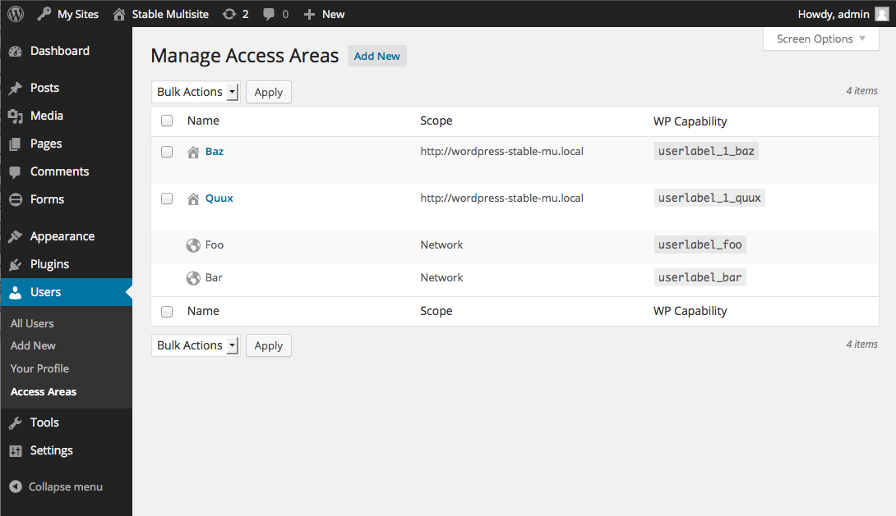
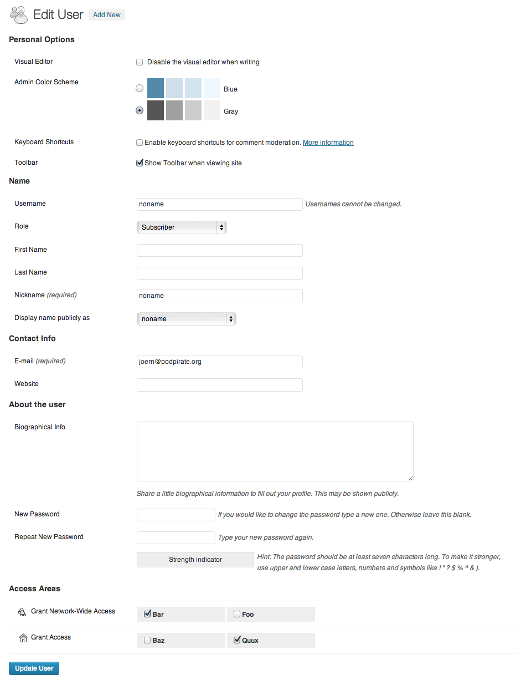
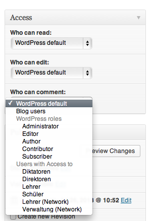

WordPress Access Areas
======================

About
-----
WP Access Areas lets you fine-tune who may read, edit or comment on your Blog posts.
You can either restrict access to logged-in uses only, certain WordPress-Roles or 
even custom Access Areas.


### Create Access Areas



### Assign Access Areas to Blog users



### Fine tune access to your blog contents



Installation
------------
Move the plugin dir in your `wp-content/` directory and activate it in the GUI.


Features
--------
- Define custom Access Areas and assign them to your blog-users
- Restrict reading, editing and commenting permission to logged-in users, certain WordPress-Roles or Access Areas
- On a Network you can define global access areas
- German and Italian localization
- Clean uninstall

Plugin API
----------
### Action hook `wpaa_view_restricted_post` ###

Is fired when a user tries to load a page he hasn't access to.
```
// Example:
function my_deny( $forbidden_post_id , $forbidden_post ) {
	echo "you are not allowed to acces the post named '{$forbidden_post->post_title}'";
	echo "Sadly you are missing the follwing content";
	echo $forbidden_post->post_content;
}
add_action('wpaa_view_restricted_post','my_deny' , 10 , 2 );
```

### Filter `wpaa_restricted_post_redirect` ### 

Alternative redirect for access restricted posts.

```
// Example:
function my_deny( $redirect , $forbidden_post_id , $forbidden_post ) {
	return "http://jump-in-a-lake.org/";
}
add_filter('wpaa_restricted_post_redirect','my_redirect' , 10 , 3 );
```

Function reference
------------------

### Checking permissions ###
#### `wpaa_user_can( $cap , $args = array() )` ####
Checks if the current user user has the the specified capability or role `$cap`.
`$args` is passed to WPs `current_user_can( $cap , $args )` function.

Will return true if one the following conditions is met:

 - If `$cap` is an access area: the user is in the specified access area
 - If `$cap` is a WP-role: the user has the specified role a superior role
 - `[current_user_can( $cap , $args )](http://codex.wordpress.org/Function_Reference/current_user_can)` is ˚true˚
 
Examples:
```
// check for a notive WP capability
wpaa_user_can( 'edit_post' , array( $post_ID ) );
```

```
// check for a WP role
wpaa_user_can( 'contributor' );
// will be true, if current user is contributor or above
```

#### `wpaa_is_access_area( $cap )` ####

Check if `$cap` is an valid access area name.

#### `wpaa_user_can_accessarea( $cap , $args = array() )` ####

Check if a user is capable of the specified access area. 
On single Sites always ˚true˚ for administrators, on multisites always true for super admins.

`$args` is passed to WPs `current_user_can( $cap , $args )` function.


### Network Related ###
#### `wpaa_is_local_cap( $cap )` ####

Check if the access area's scope is valid on the current blog. Will return false, 
if `$cap` is a globally defined access area.

#### `wpaa_get_local_prefix( $blog_id = null )` ####

Get local access area prefix for Blog `$blog_id`. If `$blog_id` is `null`, 
the current blog is used.


#### `wpaa_user_can_role( $role , $user_role_caps = null )` ####

Check if the current users capabilites (specified by his roles) cover the capabilities of `$role`.

As retrieving all capabilities for a user requires some computing you can pass all the 
user's capabilities through `$user_role_caps`, if you already declared them somewhere else.

#### `wpaa_get_user_role_caps( $user_roles = null )` ####

Get all capabilities of the roles specified by `$user_roles`.
Without arguments the function will return all capabilities of the current user.

#### `wpaa_user_contained_roles( $user_roles = null )` ####
Get all roles covered by rolenames specified by `$user_roles`.
if `$user_roles`is `null` the current user's roles are used.

Example:
```
// current user is an editor
wpaa_user_contained_roles();
// function returns array('subscriber','contributor','author','editor')
```

#### `wpaa_contained_roles( $role )` ####
Get all roles covered by `$role` specified by .

Example:
```
// current user is an editor
wpaa_contained_roles('editor');
// function returns array('subscriber','contributor','author','editor')
```

#### `wpaa_role_contains( $container , $contained )` ####
Check if role `$contained` is covered by role `$container`.

Example:
```
wpaa_role_contains('editor',`contributor`);
// true

wpaa_role_contains('editor',`administrator`);
// false
```

Compatibility
-------------
- WP 3.5.2 through 3.8.1

